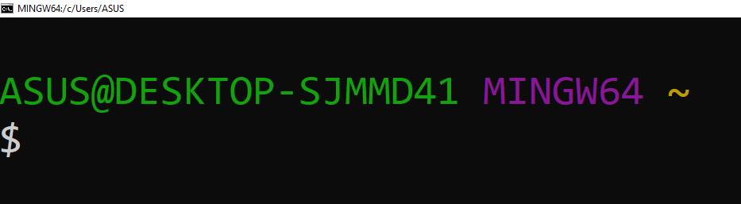

# **Writing Test Week 1**
## **Unix Command Line**
___
### **Shell**

> **Shell** adalah Program yang menerima perintah kita kemudian meneruskan perintah tersebut untuk dieksekusi oleh sistem. Dan bisa juga diartikan sebagai program yang digunakan untuk berkomunikasi atau memerintah sistem.
- Sheel terbagi 2 yaitu :
    - **Graphical User Interface (GUI)** ialah shell yang berbasis Grafis.
    Seperti : Windows, Mac OS, dan Ubuntu.
    - **Command Line Interface (CLI)** ialah shell yang berbasis Teks. Seperti : sh, bash, zsh, dan cmd.exe.

### **Command Line Interface (CLI)**

Untuk Mengakses sebuah CLI bisa menggunakan program Terminal Emulator, Command Prompt, dan Power Shell.
> Fungsi Command Line Interface (CLI), yaitu :
> - Membuat Otomasi
> - Menjalankan program command-line
> - Menggunakan development tools

> Berikut adalah cara untuk mengakses sebuah CLI menggunakan Terminal Emulator dengan jenis sheel-nya yaitu bash.


- **Dollar Sign ($)** disebut Shell Prompt
- **Dollar Sign ($)** akan muncul ketika shell sudah siap menerima input
- Di bash jika karakter terakhir dari prompt-nya adalah **Hash Mark (#)** berarti kita punya hak Superuser

> **Penulisan Command :** 


- **command** -> adalah perintah yang akan diberikan
- **-options** -> adalah keterangan tambahan terkait perintah yang di berikan
- **argument** -> adalah nilai yang diberikan sebagai bagian dari perintah

### **File System**

> **File System** ialah sebuah cara bagaimana sistem operasi mengatur dan mengorganisir file dan direktori, dan mengatur bagaimana data disimpan didalam sebuah system.
- **Root Directory** ialah direktori paling atas (tinggi)
- **Working Directory** ialah direktori yang aktif saat ini dan bisa digunakan untuk bekerja

### **Berikut beberapa command yang biasa digunakan :**

> - **Print Working Directory (`pwd`)** -> Command untuk melihat current working directory

> - **Lists (`ls`)** -> Command untuk melihat isi file yang ada di sebuah direktori
>	- `ls -a` -> untuk melihat folder dan file yang hidden
>	- `ls -l` -> untuk melihat isi dari sebuah direktori dalam bentuk long format
>	- `ls -al` ->kedua perintah diatas bisa digabung
 >   > **NOTE :** Pada sistem operasi mirip UNIX, file atau direktori yang hidden dicirikan dengan titik (.) di awal nama file atau direktori.

> - **Change Directory (`cd`)** -> Command untuk berpindah direktori
>    - `cd ..` -> untuk back atau naik ke directory di atas satu kali

> - **`head`** -> Command untuk melihat beberapa line awal dari sebuah file text
>	- `head -5 namafile` atau `head -n 5 namafile` -> untuk melihat 5 line dari sebuah file
>	- `head -1 namafile1 namafile2` -> untuk melihat priview dari 2 file sekaligus

> - **`tail`** -> Command untuk melihat beberapa line akhir dari sebuah file text
>	- penggunaannya hampir sama seperti `head`

> - **`cat`** -> Command untuk melihat seluruh isi sebuah file
>	- `cat namafile1 namafile2` -> untuk membuka beberapa file sekaligus

> - **`touch`** -> Command untuk membuat sebuah file
>	- `touch namafile1 namafile2` -> untuk membuat beberapa file sekaligus

> - **`mkdir`** -> Command untuk membuat sebuah direktori

> - **`cp`** -> Command untuk mengcopy files atau directory
>	- `cp` namafile target/namafile
>	- `cp -r namadirektori targetdirektori` -> untuk mengcopy sebuah direktori

> - **`mv`** -> (move) Command untuk memindahkan files atau directory. Dan bisa juga digunakan untuk rename.
>	- `mv namafile/direktorilama namafile/direktoribaru` -> untuk mengubah sebuah file/direktori

> - **`rm`** -> (remove) Command untuk menghapus file atau directory
>	- `rm -i namafile` -> untuk menghapus file dan mendapatkan peringatan
>	- `rm -d namadirektori` -> untuk menghapus direktori kosong
>	- `rm -r namadirektori` -> untuk menghapus sebuah direktori beserta file di dalamnya
>	- `rm -rf namadirektori` -> untuk menghapus direktori tanpa diminta konfirmasi

> - `nano namafile` -> Command untuk buka file, lalu mengisi file tersebut, kalau di GUI biasa yaitu notepad

## **Git dan GitHub**
___

### **GIT**
> **Git** adalah aplikasi yang dapat melacak setiap perubahan yang terjadi pada suatu folder atau file.
- Git berfungsi sebagai Version Control System
> **Version Control System** ialah mencatat setiap perubahan pada File (termasuk code yang kita buat) pada suatu proyek baik dikerjakan secara individu maupun tim.
- File -file yg disimpan menggunakan git akan terlacak seluruh perubahannya, termasuk siapa yang mengubah.

> ### **Keuntungan Menggunakan Git dan GitHub :**
> - Bisa berkolaborasi mengerjakan proyek yang sama tanpa harus repot copy paste folder aplikasi yang terupdate.
> - Tidak perlu menunggu rekan dalam satu tim kita menyelesaikan suatu program dahulu untuk berkolaborasi.
> - Bisa membuat file didalam projek yang sama atau membuat code di file yang sama dan menyatukannya saat sudah selesai.

> ### **Perbedaan Git dan GitHub :**
> - **Git** adalah sebuah software atau tools yang digunakan untuk melakukan manajemen versi pada sebuah project.
> - sedangkan **GitHub** adalah cloud based hosting service tempat kita menyimpan Git Repository.

> - Kita harus menginstal git pada folder kita yang ada di device yaitu membuat sebuah repository , lalu kita bisa mempush repository tersebut ke github, maka repository tersebut akan tersedia secara online. 
> - Jika kita mengubah isi dari folder tersebut di device, maka kita harus mengulangi push ke github, agar repository tersebut terupdate secara online.

> **Langkah-langkah git di local area :**
> 
> git init -> perubahan -> git status -> git add . -> git commit -m "nama/pesan dari perubahan" 

> **Langkah-langkah git di local area ke Github :**
> 
> git init -> perubahan -> git status -> git add . -> git commit -m "nama/pesan dari perubahan" -> git remote (hanya dilakukan sekali, jika sudah pernah dilakukan bisa skip langsung ke step selanjutnya) -> git push

> `git config` -> untuk melakukan inisialisasi pada git dan untuk melakukan konfigurasi git dengan memberikan nama email yang akan digunakan baik pada local project maupun global project
>
> `git init namafolder` -> digunakan untuk membuat sebuah repository
>
> `git init .` -> bisa digunakan jika folder sudah ada
>
> `git status` -> untuk melihat status dari sebuah repository
>   - Ada 3 status dalam git :
>       1. **Modified** adalah kondisi dimana revisi atau perubahan sudah dilakukan, tetapi belum ditandai (untracked) dan belum disimpan dalam version control.
>       2. **Staged** adalah kondisi dimana revisi sudah ditandai (modified) namun belum disimpan di version control.
>       3. **Commit/committed** adalah kondisi dimana revisi sudah disimpan pada version control.
>
>
>`git add .` -> untuk menandai semua file dan menyimpan semua perubahan, dan untuk mengubah status **untrackted file** dan **unmodified** menjadi **modified**.
> 
> `git commit` -> untuk save perubahan pada version control
>
> `git checkout` -> untuk membatalkan perubahan, belum stagged dan belum commited
>
> `git revert` -> untuk membatalkan semua perubahan yang ada tanpa menghapus commit terakhir
>
> `git reset` -> untuk membatalkan semua perubahan yang ada tetapi commit terakhir akan terhapus
>
> `git branch` -> untuk membuat percabangan pengerjaan, agar meminimalisir konflik code saat pengerjaan.
>
> `git merge` -> untuk menyatukan branch cabang fitur yang telah dikembangkan sebelumnya ke branch utamanya.
>
> `git remote` -> untuk menghubungkan remote repository dengan project local yang telah dibuat direktorinya

## **HTML**
___

> **Hyper Text Markup Language (HTML)** adalah bahasa komputer yang digunakan untuk membuat kerangka atau struktur untuk Web pages (halaman website) di internet.

> HTML berfungsi sebagai 'kerangka', yang memberi struktur pada website.


> **HTML Tag**
> - HTML terdiri dari komponen yang disebut HTML Tag
>
> - Pada umumnya, ada 2 tipe HTML Tag :
>   1. Opening Tag (tag pembuka)
>   2. Closing Tag (tag penutup)

> **Struktur Dokumen HTML**
> 
> - Dokumen HTML memiliki 3 tag utama, yaitu `<html>`,`<head>`, dan `<body>`. 
> - Ketiga tag tersebut harus diketik persis seperti contoh di bawah ini:
> ```json
>    <!DOCTYPE html>
>    <html>
>        <head>
>        ...
>        </head>
>        <body>
>        ...
>        </body>
>    </html>
>```

> **HTML Element**
> - HTML Element merupakan sebuah komponen dalam halaman web, bisa berupa paragraf, judul, atau gambar.
> - Ada dua jenis HTML Element, yaitu :
>   1. HTML Element yang memiliki Opening Tag (tag pembuka) dan Closing Tag (tag penutup). Seperti  `<p>` dan `</p>`.
>   2. Empty HTML Element ialah Self-closing Tag, yang hanya memiliki Opening Tag (tag pembuka) dengan garis miring sebelum kurung tutup. Seperti `<br />` atau ``.

> **HTML Attribute**
> - Berfungsi untuk memberikan informasi tambahan kepada sebuah element.
> - Contoh penggunaan attribute:
>    ```json
>    <!--  adalah tag untuk memasukkan element gambar -->
>    
>    ```
>
> - Pada kode di atas, tag `` memiliki dua attribute:
>      - `width` yang berfungsi untuk menentukan lebar dari element gambar, dan diberikan value (nilai) lebar sebesar 80%
>      - `src` yang berfungsi untuk menentukan sumber gambar, dan diberikan value (nilai) untuk diarahkan ke tautan `https://bit.ly/3laVBck`

> **HTML Comment**
> - **comment** adalah catatan kecil yang bisa kita tambahkan ke dalam kode sumber (source code) tanpa mengubah fungsi dari program yang kita buat.
> - HTML comment diawali dengan `<!-- dan diakhiri dengan -->`


> **HTML Tag Untuk Menampilkan Teks**
>
> **1. Heading**
> -  Tag heading hanya memiliki 6 tingkatan. Penulisannya seperti di bawah ini : 
> ```json
>    <h1>Heading Satu</h1>
>    <h2>Heading Dua</h2>
>    <h3>Heading Tiga</h3>
>    <h4>Heading Empat</h4>
>    <h5>Heading Lima</h5>
>    <h6>Heading Enam</h6>
> ```   
>
> **2. Paragraf**
> - Untuk membuat paragraf pada halaman website, maka dibutuhkan tag `<p>`
>
> **3. Link/Anchor**
> - Untuk membuat link pada halaman web, maka diperlukan tag `<a>`
> - Tag `<a>` memiliki attribute href yang berguna untuk menyimpan link website yang dituju.
> - Penggunannya seperti ini:
> ```
> <a href="https://google.com">Google</a>
>```
>   
> **4. Span**
> - Tag `<span>` digunakan untuk mengelompokkan tulisan dalam satu baris. 
> - Pada umumnya sering digunakan untuk menambahkan CSS pada suatu tulisan pada satu baris, tapi tidak menutup kemungkinan digunakan untuk hal lainnya.
> - Contoh penggunaan:
> ```
>    <p>Kucingku bermata <span style="color:blue"> biru</span></p>
> ```
>
> **5. Huruf Tebal**
> - Tag `<b>` atau `<strong>` digunakan untuk membuat tulisan menjadi tebal.
>
> **6. Huruf Miring**
> - Untuk membuat huruf bercetak miring, maka dibutuhkan tag `<i>` atau `<em>`.
>
> **7. List**
> - Ada 2 tipe list di HTML, yaitu: 
>   1. Tag `<ul>` -> Unordered list
>   2. Tag `<ol>` -> Ordered list 
> - Masing-masing list baik `<ul>` atau `<ol>` memiliki element `<li>` untuk mendefinisikan nilai-nilai dari list tersebut.

> **HTML Tag Untuk Multimedia**
> 
>**1. Gambar**
> - Untuk menampilkan gambar pada halaman sebuah website, maka kita membutuhkan tag .
> - Contoh penggunaannya:
> ```
>    
> ```   
>
> **2. Video**
> - untuk bisa menambahkan video pada halaman web dengan menggunakan tag `<video>`
> - Format video yang didukung antara lain: mp4, ogg, dan webM.
> - Contoh Penggunaan :
> ```
>   <video width="320" height="240" src="link-ke-videonya"></video>
> ```    
> atau dengan mengapit element `<source>` di antara element `<video>` seperti ini :
> ```    
>    <video width="320" height="240">
>    <source src="link-ke-video-nya" type="video/tipe-videonya"/>
>    </video>
> ```  
>
> **3. Suara**
> - Untuk menampilkan suara pada halaman sebuah website bisa menggunakan tag `<audio>`
> - Format yang didukung pun meliputi mp3, wav, dan ogg.

   
> **HTML Tag Untuk Tabel**
> - Pada dasarnya, untuk membuat sebuah tabel di HTML cukup membutuhkan tiga tag, yaitu:
> 1. `<table>` sebagai element utama.
> 2. `<tr>` atau dikenal sebagai table row tag, digunakan untuk membuat baris baru di dalam `<table>`.
> 3. `<td>` atau dikenal sebagai table data tag, digunakan sebagai container (wadah) dari data yang kita mau isi di dalam `<tr>`.

> **HTML Tag Untuk Formulir**
> 1. Formulir
>       - Tag `<form>` digunakan untuk mengawali pembuatan form.
> 2. Input
>       - Tag `<input>` digunakan untuk membuat kotak input dimana user akan mengisi data
> 3. Select dan Option
>       - Pilihan dropdown pada halaman sebuah website menggunakan tag `<select>` dan `<option>` dalam membuatnya.
> 4. Fieldset
>       - Tag `<fieldset>` akan memberikan garis tepi pada element-element HTML yang ingin kita kelompokkan.
> 5. Tombol
>       - Untuk membuat sebuah tombol yang dapat diklik, maka kita memerlukan tag `<button>`, dan juga bisa menggunakan tag `<input>` dengan type button atau submit.

> **HTML Tag Untuk Membagi Layout Website**
>
> - **Layout Wesite** suatu website biasanya terdiri dari:
>
>       - Header
>       - Navigation bar
>       - Main Content
>       - Footer
> - Berikut adalah beberapa contoh dari semantic element:
>   - `<section>` menandakan bagian dalam sebuah halaman web.
>   - `<header>` merupakan bagian tajuk dari sebuah halaman web.
>   - `<footer>` merupakan bagian halaman web yang terletak di bagian bawah konten utama.
>   - `<article>` menandakan sebuah blok teks yang isinya independen terhadap element lain dalam halaman web.
>   - `<nav>` adalah bagian yang berisi tautan navigasi utama. Kalian mungkin sering melihat menu navigasi yang berisi tautan ke halaman "Beranda", "Kontak kami", "Galeri", dan lain-lain.
>   - `<aside>` adalah bagian di samping konten utama. Kontennya sebaiknya berhubungan dengan element di sebelahnya.

## **CSS**
____

> **Cascading Style Sheets (CSS)** adalah bahasa komputer yang digunakan untuk menambahkan design ke suatu halaman website di internet.

> Ada 3 cara untuk menyisipkan CSS ke dalam HTML, yaitu :
> - **Inline CSS** yaitu menggunakan attribute style untuk menyisipkan kode CSS langsung di dalam HTML element.
> - **Internal CSS** yaitu menggunakan element `<style>` untuk menyisipkan kode CSS. Element `<style>` tersebut diletakkan di dalam element .
> - **External CSS** yaitu sebuah file CSS terpisah yang disambungkan dengan file HTML dengan menggunakan element `<link>`.

> **CSS Syntax** adalah syntax yang digunakan untuk menunjuk atau memilih HTML element mana yang ingin diberi style (dihias). CSS syntax terdiri dari selector, property, dan value.
> ```
> selector {
>	  property: value;
>	}
> ```
> - Jika kita ingin memberikan style pada semua element di website, maka kita bisa menggunakan * sebagai selector.

- Satu element hanya bisa mempunyai satu buah id. Dan sebuah id sebaiknya tidak digunakan dalam lebih dari satu element pada tiap halaman.
- Class bisa digunakan dalam lebih dari satu element. Serta sebuah element bisa memiliki lebih dari satu class.

> **Penulisan CSS**
> - Kalau dipisah dengan `spasi` artinya semua element yang ada di dalam, kalau dipisah dengan tanda `(>)` artinya semua element yang merupakan child.
> - Jika kita ingin memberikan style yang sama pada lebih dari satu element sekaligus, maka kita bisa menulis lebih dari satu selector, namun dipisah dengan tanda koma `(,)` dari selector yang satu dengan yang lain.

> **Flexbox (Flexible Box)** memudahkan para programmer untuk mengatur layout, posisi, dan ukuran dari tiap element di dalamnya.
> - Ada dua istilah penting saat belajar flexbox:
>   - `container` adalah element yang membungkus dan mengatur tampilan dari element di dalamnya,
>   - `item` adalah element dalam container yang diatur tampilannya.
> - Contoh Penggunaan :
>```
><head>
>	<style>
>       #flex-container {
>			display: flex;
>			flex-direction:row;
>		}
>       .flex-item {
>			flex-basis: 100%;
>			height: 100px;
>			margin: 4px;
>			background: #ec5453;
>			font-size: 60px;
>			color: white;
>			text-align: center;
>		}
>	</style>
></head>
>
><body>
>	<div id="flex-container">
>		<div class="flex-item">1</div>
>		<div class="flex-item">2</div>
>		<div class="flex-item">3</div>
>	</div>
></body>
>```

## **Algoritma**
___

> Perbedaan algoritma dan struktur data : 
> - **Algoritma** adalah sederetan langkah-langkah logis yang disusun secara sistematis untuk memecahkan suatu masalah.
> - Sedangkan **Struktur data** adalah cara penyimpanan , pengorganisasian , dan pengaturan data di dalam media penyimpanan komputer sehingga data tersebut dapat digunakan secara efisien. 

> **Manfaat Algoritma**
> -	Untuk membantu menyederhanakan atau mempersingkat proses satu program yang rumit dan besar
> -	Untuk memudahkan dalam hal membuat dan mengembangkan sebuah program untuk masalah tertentu
> -	Algoritma dapat digunakan terus menerus sebagai solusi untuk menyelesaikan suatu permasalahan
> -	Membantu memecahkan suatu permasalahan dengan logika,  terstruktur  dan sistematis
> -	Untuk meminimalisir sehingga mengurangi penulisan program secara berulang ulang
> -	Untuk memudahkan membuat sebuah program yang lebih rapi dan terstruktur sehingga lebih mudah dipahami, diubah dan dikembangkan di kemudian hariu
> -	Memudahkan proses modifikasi atau perubahan pada program karena bisa dilakukan hanya pada satu modul tertentu tanpa harus mengubah modul lainnya
> - Jika suatu saat terjadi kesalahan, algoritma dapat membantu menemukannya karena alur kerja dan perencanaan yang jelas
> - Memudahkan proses dokumentasi program pada suatu proyek

> **Manfaat Struktur Data :**
> -	Memudahkan dalam menggunakan konsep algoritma pemrograman
> -	Efisiensi atau minimalkan memori yang dipakai
> -	Memudahkan dalm pengaturan data
> -	Mempercepat dalam penyelesaian masalah saat pengembangan programm
> -	Memudahkan dalam menyusun bahasa pemrograman

> Contoh Algoritma Sederhana :
> - Yaitu bisa berupa langkah-langkah untuk menyelesaikan sesuatu, kegiatan yang kita lakukan sehari-hari bisa dibuat ke salah satu contoh algoritma sederhana.
> - Seperti : Saat dilampu merah, jika lampu berwarna Merah maka berhenti, jika lampu berwarna Kuning maka berhari-hati, dan jika lampu berwarna Hijau maka Jalan Terus.

> Mengubah Algoritma ke dalam Psedocode :
> ```
> BEGIN
>   SET lampu = "merah"
>   IF lampu IS "merah" THEN
>       DISPLAY "STOP"
>   ELSE IF lampu IS "kuning" THEN
>       DISPLAY "WAIT"
>   ELSE 
>       DISPLAY "GO"    
>   END IF 
>END

## Javasricpt
___

> **Javascript** berfungsi sebagai element yang membuat website menjadi interaktif.

- Syntax untuk output di javascript `console.log`
	- output tidak akan muncul di halaman website, hanya muncul di tab console
	- Penulisan -> `console.log(namaVariabel);`

> **Tipe Data**
> 	- ***Number*** -> bilangan bulat, pecahan, dan lain-lain
>	- ***String*** -> deretan karakter yang diapit oleh sepasang tanda kutip
>	- ***Boolean*** -> nilai benar dari sebuah pernyataan yang dituliskan sebagai true atau false
>	- ***Object*** -> sebuah kumpulan pasangan properti dan nilai. Seperti objek dalam kehidupan sehari-hari saja. Misalnya objek Apel memiliki properti warna dengan nilai merah
>	- ***Null*** -> sebuah nilai yang berarti kosong atau menunjuk pada nilai yang tidak ada
>	- ***Undefined*** -> yaitu jika sebuah variabel yang tidak ada isi nilai-nya / belum diberi nilai
>	- ***Symbol*** -> sebuah nilai unik yang dihasilkan tiap kali kita memanggil fungsi Symbol(). Nilai unik ini memiliki beberapa kegunaan seperti memberi nomor identifikasi unik dan berperan sebagai nama properti unik sebuah objek

> **Pendeklarasian Variabel**
>	- `var` -> sudah tidak dipakai, kecuali <ES6, karena memiliki banyak kelemahan
>	- `let` -> nilai dapat diubah
>	- `const` -> nilai tidak dapat diubah. Pengecualian : didalam array bisa diubah/tipe data object

> **Peraturan Nama Variabel**
> - camelCase
> - Hanya boleh diawali '_' dan '$'
>- Tidak boleh diawali huruf besar

> ### **Operator**
>**1. Operator Aritmatika**
>	- ** (Eksponen/pangkat)
>	- % (Modulus/Sisa Bagi)
>	- ++ (Increment)
>	- -- (Decrement)
>
> **2. Operator Perbandingan**
>	- == (sama dengan - cek nilai) 
>	- === (sama dengan - cek nilai dan tipe data) 
>	- != (tidak sama dengan - cek nilai) 
>	- !== (tidak sama dengan - cek nilai dan tipe data)
>	- ? : (ternary operator) 
>
> **3. Operator Logika**
>	- && (AND)
>	- || (OR)
>	- ! (NOT)

> ### **Conditional**
> - Di JavaScript ada 2 cara menulis perintah conditional, yaitu:
>   1. Menggunakan if, else if dan else.
>       - `if` -> digunakan apabila hanya ada 1 kondisi dan 1 keputusan yang dijalankan
>       - `if...else` -> digunakan apabila ada 1 kondisi dan 2 keputusan yang dijalankan
>       - `if...else if...else` -> digunakan apabila ada beberapa kondisi dan beberapa keputusan yang dijalankan
>   2. Menggunakan switch dan case
>```
>       switch(){
>            case 1:
>            break;
>            case 2:
>            break;
>            default:
>        }
>```

> ### **Looping**
> >**LOOP** adalah sekumpulan kode yang akan dijalankan berulang kali sampai batas yang ditentukan
> - Ada 5 jenis loop di JavaScript, yaitu:
> ```		
>   for
>   for...in
>   for...of
>   while
>   do...while
>```
>	- Syntax yang digunakan ketika menggunakan `for loop`
>```
>for (pernyataan1; pernyataan2; pernyataan3) {
> 		// kode yang akan dijalankan ketika pernyataan2 benar (true)
>		}
>```
> >- pernyataan1 digunakan untuk menentukan nilai awal berjalannya loop.
> >- pernyataan2 digunakan untuk mendefinisikan kondisi berjalannya sebuah loop. Apabila nilai kondisinya false, maka loop akan berakhir.
> >- pernyataan3 digunakan untuk menambah atau mengurangi nilai awal pada pernyataan1 setiap kali loop dijalankan.
>
> - Syntax yang digunakan ketika menggunakan `for...in loop`
> ```
>for (propertiObjek in namaObjek) {
>  		// kode yang akan dijalankan
>		}
>```
> >- `for (propertiObjek in namaObjek)` berarti untuk setiap propertiObjek di namaObjek, maka jalankan kode di dalam {}. Variabel propertiObjek bisa diganti dengan nama variabel apapun
>
>> Perbedaan `for loop` dengan `for...in loop`
>> - `for loop` digunakan untuk mengulang suatu operasi hingga batas waktu yang ditentukan 
>> - sedangkan `for...in loop` digunakan untuk mengulang properti dari suatu objek
>
> - Syntax dalam menggunakan `while loop`
>```
>while (kondisi) {
> 			// kode yang akan dijalankan ketika kondisi benar (true)
>		}
>```
>> - `while (kondisi)` berarti ketika kondisi yang ditentukan benar (true), maka jalankan semua kode yang ada di dalam {}.
>
> - Syntax dalam penggunaan `do...while loop`
>```
>let i = 1;
>
>		do {
>		  console.log(i);
>		  i++;
>		} while (i <= 10);
>```

> ## NOTE :
> - Fungsi HTML adalah sebagai 'kerangka', yang memberi struktur pada website.
> - Fungsi CSS sebagai 'baju', yang memberi warna dan layout pada website.
> - Fungsi JavaScript sebagai 'element', yang membuat website menjadi interaktif.# Web-Development-Basic
