# **Writing Test Week 2**
# **JAVASCRIPT**

## **SCOPE**
___

> **Scope** adalah konsep dalam flow data variabel. Yaitu menentukan suatu variabel bisa diakses pada scope tertentu atau tidak.

> **Blocks** adalah code yang berada didalam curly braces {}. Penggunaan blocks yaitu conditional, function, dan looping.

### **Jenis-Jenis Scope :**
**1. Global Scope**
> **Global Scope** ialah variabel yang dapat diakses dimanapun dalam suatu file. Agar menjadi global scope, suatu variabel harus dideklarasikan **diluar Blocks**.

> **Contoh Penggunaan Global Scope**
>
> 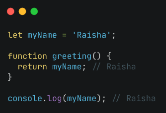
>
> Variabel myName adalah contoh penggunaan Global Scope, yang dapat diakses dimana saja dalam satu file tersebut.

**2. Local Scope**
> **Local Scope** ialah mendeklarasikan variabel **didalam blocks** seperti function, conditional, dan looping. Dan variabel tersebut hanya bisa diakses didalam blocks saja, tidak bisa diakses diluar blocks.

> **Contoh Penggunaan Local Scope**
>
> 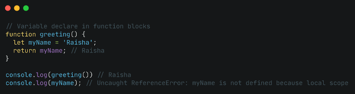
>
> Variabel myName adalah contoh penggunaan Local Scope, yang hanya dapat diakses dalam function/block tersebut, jika diakses diluar function/block tersebut maka akan error.

## **FUNCTION**
___
> **Function** adalah sebuah blok kode dalam sebuah grup untuk menyelesaikan 1 task/1 fitur. Ketika membutuhkan fitur tersebut nantinya, maka fitur tersebut bisa digunakan kembali.

- **Membuat Function**

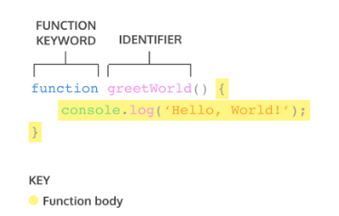

- **Memanggil Function**

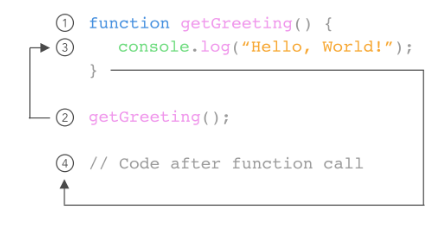

### **Parameter**
> **Parameter** ialah syarat input yang harus dimasukkan ke dalam suatu function dan dideklarasikan bersama dengan deklarasi function.

Saat membuat function/fitur, kita harus tahu data-data yang dibutuhkan. Misalnya saat membuat function penambahan 2 buah nilai. Data yang dibutuhkan adalah 2 buah nilai tersebut.
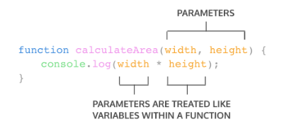

### **Argument**
> **Argument** adalah nilai yang dimasukan ke dalam suatu function, sesuai dengan persyaratan parameter, di mana argument dituliskan bersamaan dengan pemanggilan function.

Jumlah argument harus sama dengan jumlah parameternya. Jadi jika di function penambahan ada 2 parameter nilai saat membuat function, maka saat memanggil function gunakan 2 buah nilai argument tersebut.
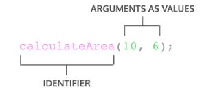

### **Default Parameter**
> **Default Paramater** digunakan untuk memberikan nilai awal/default pada parameter function.

Ketika sebuah fungsi memiliki parameter tetapi tidak dimasukkan argument maka akan otomatis diisi oleh UNDEFINED. Untuk menghindari kesalahan tersebut, maka buatlah Default Parameternya.
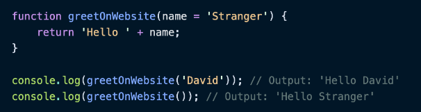

### **Function Helper**
> **Function Helper** ialah menggunakan function yang sudah dibuat pada function lain.
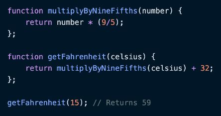

### **Arrow Function**
> **Arrow Function** adalah cara lain menuliskan function. Ini adalah fitur terbaru yang ada pada ES6 (Javascript Version). Biasa disebut *Short Syntax Function*.

> **Penggunaan Short Syntax Function**
> 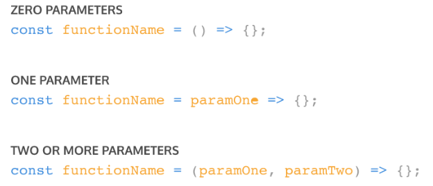
> 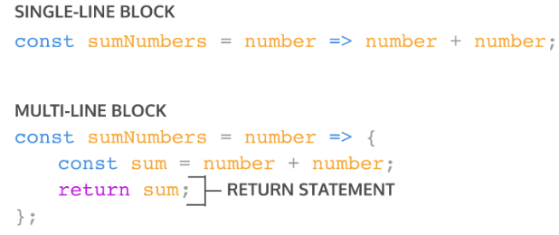

> ### **NOTE :**
> - Sebuah function bisa disimpan di dalam variabel
> - `console.log()` hanya menampilkan informasi ke dalam tab console JavaScript, sedangkan return akan mengembalikan sebuah nilai ke tempat di mana fungsi itu dipanggil
> - Di JavaScript, apabila tidak ada perintah return, secara default (standar) fungsi tersebut akan mengembalikan nilai undefined
> - Di Javascript, kita dapat memanggil fungsi sebelum deklarasi fungsi tersebut (kecuali fungsi yg ada didalam variabel)

## **DATA TYPE**
___
> **Data Type** adalah jenis data yang dapat disimpan, dimanipulasi, dan digunakan untuk memberi tahu komputer bagaimana menfasirkan nilai atau datanya. Data Type menentukan jenis data yang dimiliki variabel dan tipe operasi, seperti operasi matematika, logika dan sebagainya.

### **Data Type di Javascript ada 2, yaitu :**

### **1. Primitif**
> Tipe data primitif hanya dapat menyimpan satu nilai pada satu waktu dan tidak dapat diubah menggunakan cara yang sama seperti tipe data non-primitif. Tipe data Primitif akan dianggap sama jika nilainya sama.

Di JavaScript ada tujuh tipe data primitif yang bisa digunakan yakni String, Number, BigInt, Boolean, undefined, null, dan Symbol.

> **String**
> > Tipe data String digunakan untuk mewakili data tekstual atau karakter.
> - String dapat dibuat menggunakan petik tunggal atau ganda dan diakhiri dengan petik yang sama, dan bisa dimasukkan karakter diantara petik.
> - Jika di dalam String terdapat petik tunggal, maka harus menggunakan petik ganda sebagai pembungkus String, begitu pula sebaliknya.
> - Jika aturan ini tidak diikuti, petik yang ditulis di dalam String akan dianggap sebagai petik penutup.
> - Atau kita bisa meng-escape menggunakan backslash.
>
> **Contoh :**
> 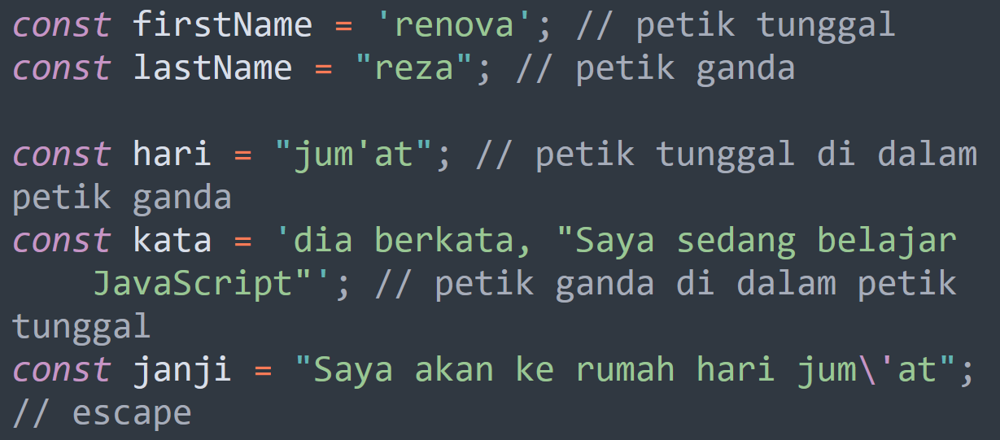

> **Number**
> > Tipe data Number atau angka di JavaScript mewakili angka positif dan negatif entah itu bulat (integer) maupun desimal (floating-point).
> - Tipe data number juga memiliki nilai khusus yaitu Infinity, -Infinity, dan NaN.
> - Nilai tak terhingga (Intinity, dan -Infinity) dihasilkan dari pembagian bilangan selain 0 dibagi dengan 0.
> - Nilai pada tipe data Number memiliki batasan, batas bilangan negatif adalah −9007199254740991 sedangkan positif 9007199254740991.
> 
> **Contoh :**
> 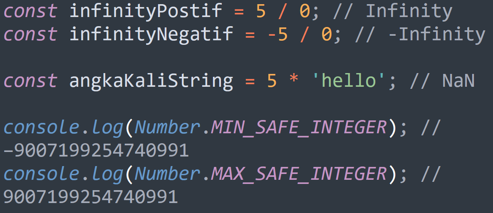

> **BigInt**
> > BigInt adalah tipe data baru yang diperkenalkan pada ES2020.
> - BigInt digunakan untuk menyimpan bilangan bulat tanpa batasasan seperti Number. Dan bisa melakukan operasi matematika dengan aman tanpa khawatir hasilnya salah.
> - Untuk membuat nilai dengan tipe data BigInt sama seperti Number, namun kita perlu mengakhiri nilai dengan huruf 'n'
> - Namun, ini hanya bisa digunakan pada bilangan bulat, tidak bisa digunakan pada bilangan desimal.
> - Operasi matematika harus menggunakan nilai yang sama-sama BigInt.
> 
> **Contoh :**
> 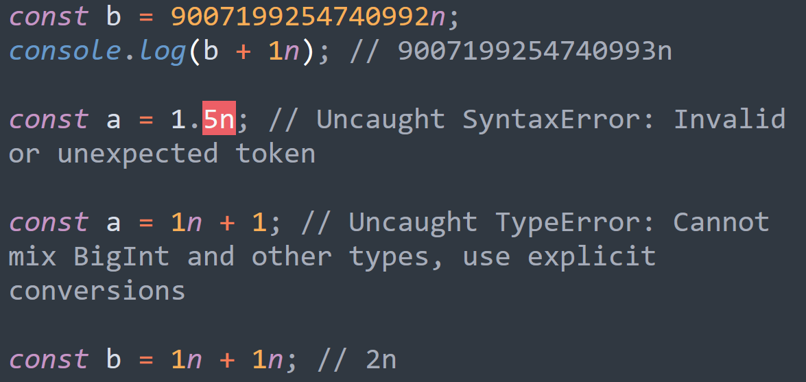

> **Boolean**
> > Boolean adalah tipe data yang hanya memiliki dua nilai, true dan false.
> 
> **Contoh :**
> 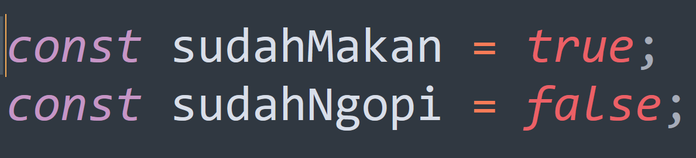

> **Undefined**
> > Undefined adalah nilai yang diberikan ketika variabel dideklarasikan tanpa inisialisasi atau tidak diberi nilai.
> - Ini hanya berlaku untuk variabel let dan var, karena tidak dapat mendeklarasikan variabel const tanpa nilai.
> 
> **Contoh :**
> 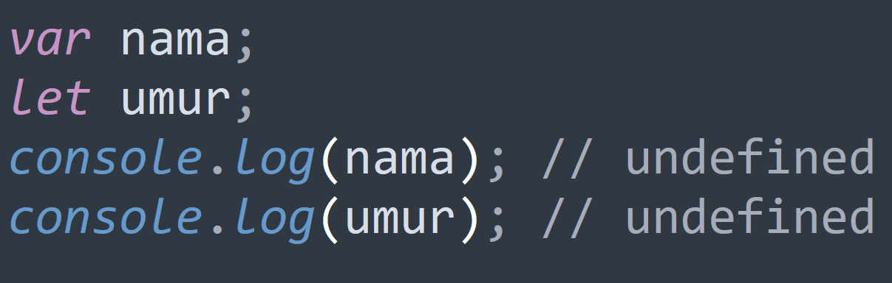

> **Null**
> > Null dapat digunakan untuk mewakili ketidakhadiran yang disengaja dari nilai objek.
> - Kita dapat menetapkan null ke variabel untuk menunjukkan bahwa saat ini variabel tersebut tidak memiliki nilai apa pun, tapi nanti akan memilikinya.
> 
> **Contoh :**
> 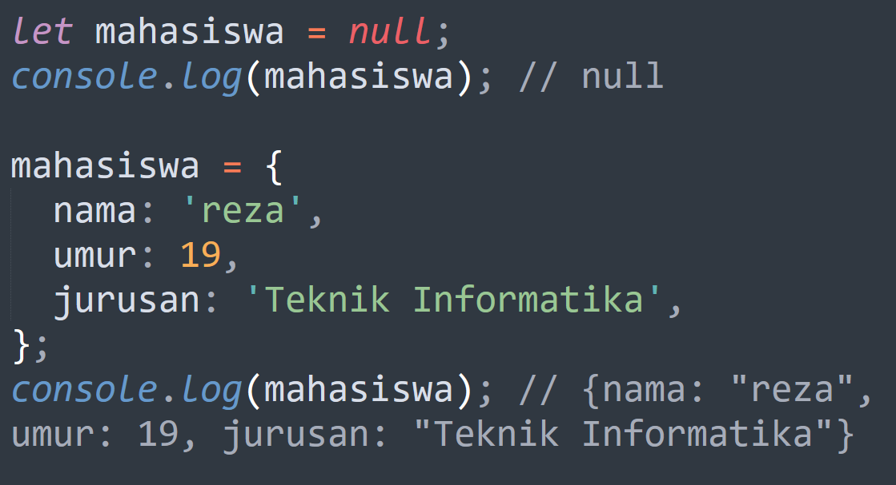

> **Symbol**
> > Symbol adalah tipe data baru yang diperkenalkan pada JavaScript ES2015.
> - Nilai yang memiliki tipe data Symbol disebut sebagai "nilai Symbol".
> - Nilai Symbol dibuat dengan menjalankan fungsi Symbol yang secara dinamis menghasilkan nilai unik. Nilai sebenarnya bersifat anonim, tidak bisa dilihat.
> - Symbol biasanya digunakan sebagai nama kunci saat menambahkan properti baru ke objek agar tidak menimpa properti dengan nama yang sudah ada.
> 
> **Contoh :**
> 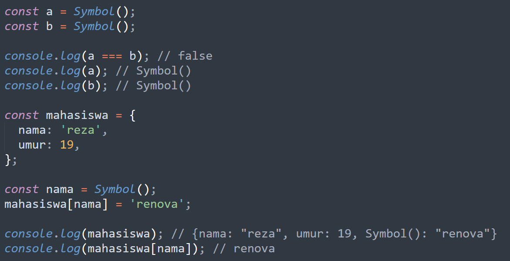

### **2. Non-Primitif**
> Ada banyak tipe data non-primitif di JavaScript diantaranya Array, Object, Map, Set, WeakMap, WeakSet, Date dan sebagainya, semuanya adalah Object.

> **Array**
> > Array adalah tipe variabel yang dapat menampung berbagai jenis data dengan tipe yang bermacam-macam, dengan jumlah yang tidak terbatas, tanpa properti seperti objek.
> - Array memiliki indeks yang dimulai dari nol dengan kata lain elemen atau nilai pertama di dalam array memiliki indeks 0, elemen berikutnya memiliki indeks 1 dan seterusnya. kita bisa menggunakan indeks untuk memanipulasi nilainya.

> **Object**
> > object adalah tipe data yang kompleks yang memungkinkan kita menyimpan kumpulan nilai dengan tipe data yang berbeda. Objek berisi properti yang didefinisikan sebagai pasangan kunci dan nilai (key dan value).

## **Math Object**
____
> **Math Object** ialah salah satu objek yang sudah merupakan "bawaan" dari javascript (dinamakan built-in object.

- Objek Math memiliki properti, nilai, dan method
- Objek Math hanya bisa digunakan untuk tipe data number, dan tidak bisa digunakan untuk tipe data BigInt
> **Ada 8 properti objek Math, yaitu**
>- `Math.E`         // Bilangan Euler
>- `Math.LN2`       // Log 2 
>- `Math.LN10`      // Log 10
>- `Math.LOG2E`     // Log E di Basis 2
>- `Math.LOG10E`    // Log E di Basis 10
>- `Math.PI`        // Pi
>- `Math.SQRT1_2`   // Akar Kuadrat dari 0.5
>- `Math.SQRT2`     // Akar Kuadrat dari 

> **Berikut beberapa Method di objek Math :**
>- `Math.abs(x)` digunakan untuk mengubah angka x yang bernilai negatif menjadi positif
>- `Math.pow(x, y)` digunakan untuk menghitung hasil dari x pangkat y
>- `Math.sqrt(x)` digunakan untuk menghitung akar kuadrat dari x
>- `Math.cbrt(x)` digunakan untuk menghitung akar pangkat 3 dari x
>- `Math.round(x)` digunakan untuk membulatkan angka desimal x menjadi bilangan bulat. Pembulatan ke atas bila angka di belakang koma lebih besar atau sama dengan 5, dan pembulatan ke bawah jika angka di belakang koma kurang dari 5
>- `Math.floor(x)` digunakan untuk membulatkan angka desimal x ke bawah
>- `Math.ceil(x)` digunakan untuk membulatkan angka desimal x ke atas
>- `Math.random()` digunakan untuk menampilkan angka secara acak antara 0 hingga 1 (0 termasuk. 1 tidak)
>- `Math.max(x, y, z, ..., n)` digunakan untuk mencari angka terbesar di antara parameter x, y, z, ..., n
>- `Math.min(x, y, z, ..., n)` digunakan untuk mencari angka terkecil di antara parameter x, y, z, ..., n

## **DOM (Document Object Model)**
___
> Dengan adanya DOM ini, JavaScript diberi akses untuk membuat HTML menjadi dinamis, seperti:
>- Mengubah element HTML pada halaman website.
>- Mengubah attribute HTML pada halaman website.
>- Mengubah CSS style pada halaman website.
>- Menambah dan/atau menghapus element maupun attribute HTML.
>- Menambah HTML event (contoh: efek klik pada mouse, hover pada mouse, dan lain-lain) pada halaman website.
>- Berinteraksi dengan semua HTML event di website.

**Contoh Penggunaan :**
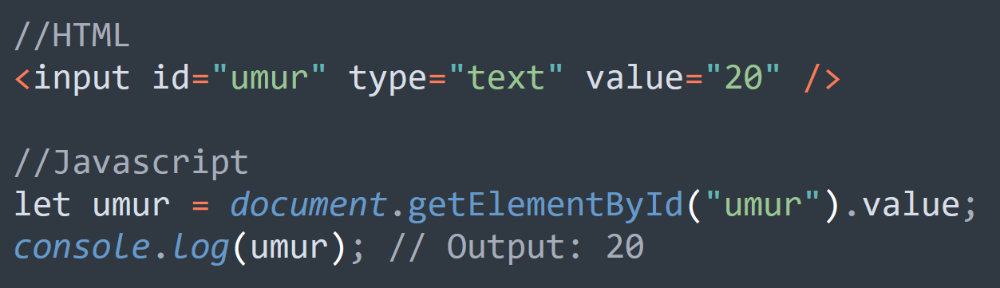

> ### **DOM method**
>- `getElementById(id)` Untuk mengakses element HTML berdasarkan nilai id-nya.
>- `getElementsByTagName(tag)` Untuk mengakses element-element HTML berdasarkan jenis tag-nya.
>- `getElementsByClassName(className)` Untuk mengakses element-element HTML berdasarkan nilai attribute class-nya.
>- `querySelectorAll(cssSelector)` Untuk mengakses element-element HTML berdasarkan CSS Selector-nya HTML.

> ### **DOM Event**
>- `element.onclick` yaitu HTML Event yang akan terjadi ketika user klik suatu element HTML.
> 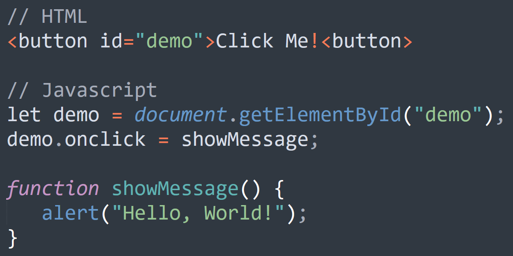
>- `element.innerHTML` ialah DOM Property innerHTML untuk mengambil/mengubah isi HTML dari sebuah element.
> 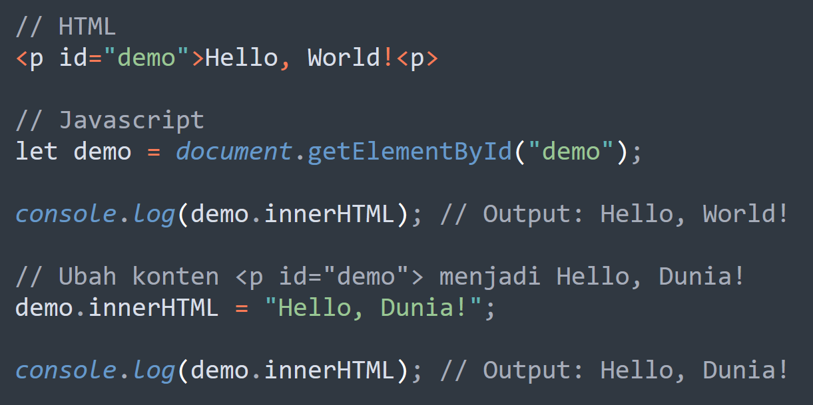
>- `element.attribute` ialah DOM Property yang bisa digunakan untuk mengambil/mengubah/menambah nilai attribute dari sebuah element.
> 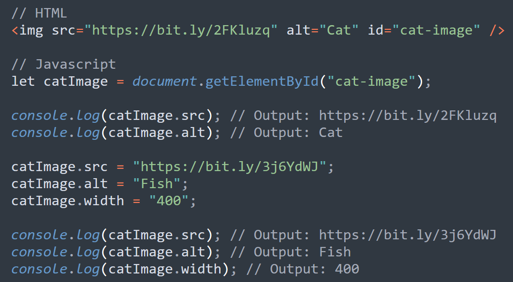
>- `element.setAttribute(attribute, nilai)` termasuk DOM Property.
> 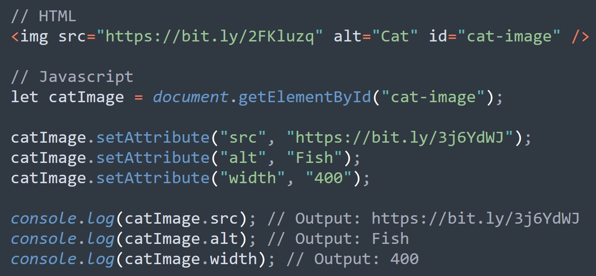
>- `element.style.property` adalah untuk mengambil/mengubah/menambah CSS dari element HTML.
> 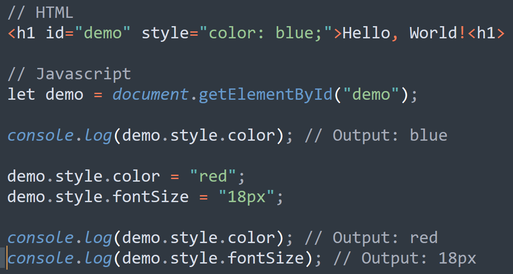

