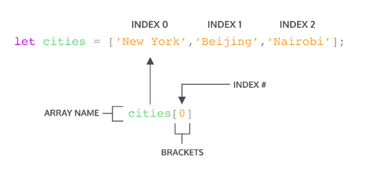

# **Writing Test Week 3**

# **JAVASCRIPT INTERMEDIATE**

## **ARRAY**

> **Array** adalah tipe data list order yang dapat menyimpan tipe data apapun di dalamnya.

Array dapat menyimpan tipe data String, Number, Boolean, dan lainnya.

Array terbagi menjadi 2 jenis :

**1. Array Satu Dimensi**

**Contoh**

```javascript
// To do List
// 1. Kuliah
// 2. Mengerjakan Tugas
// 3. Latihan Soal

let toDoList = [
    "Kuliah", 
    "Mengerjakan Tugas", 
    "Latihan Soal"
];
console.log(toDoList);
```
**2. Multidimensional Array**

bisa dianalogikan dengan **array of array** (Ada array didalam array)
**Contoh**

```javascript
// To do List
// 1. Kuliah
// 2. Mengerjakan Tugas
// 3. Latihan Soal

let stok = [
    ["Gamis", 10] 
    ["Blouse", 5], 
    ["Rok", 15]
];
console.log(stok[1][0]); // Output : Blouse
```
**Mendeklarasi Array**

Array didefinisikan menggunakan square brackets
```javasript
// Square Baracket
[]
```
**Array pada javascript dihitung dari index data ke-0, data pertama adalah index ke-0.**



**Memanggil data di dalam array**

1. Tunggal
```javascript
console.log(namaBuah[3]); 
```
2. Tunggal & Terakhir
```javascript
console.log(countries[countries.length - 1]);
```
3. Seluruhnya 
```javascript
console.log(olahraga);
```

**Mengubah nilai array**
```javascript
let warna = ['hitam', 'merah', 'ungu', 'kuning'];

warna[3] = 'biru';
// mengubah index ke-3 menjadi 'biru', index ke-3 yaitu 'ungu'

console.log(warna); // Output :['hitam', 'merah', 'biru', 'kuning'];
```

> **Cons In Array**
> - Jika menggunakan let, kita dapat mengubah array  dengan array baru dan konten nilai yang ada di dalam array dengan nilai lain
> - Const tidak bisa melakukan update data. Namun pada Array kita dapat melakukan update konten nilai di dalam array (mutable).
> - Yang tidak bisa adalah mengubah array dengan array yang baru jika menggunakan const

**Array Properties**
> Array memiliki 5 properti yang sering digunakan yaitu :
> - constructor
> - length
> - index
> - input
> - prototype.

**Array Method**
> Array memiliki method atau biasa disebut **built-in methods**
> - Maksudnya Javascript sudah memudahkan kita dengan menyediakan function/method umum yang bisa kita gunakan.
> - Kita tidak perlu membuat function lagi jika method yang kita butuhkan sudah tersedia.

**Berikut Beberapa Contoh Array Method :**
```javascript
.push() 
// adalah method untuk menambahkan item  array pada urutan yang paling akhir.
.pop() 
// adalah method yang menghapus item array index terakhir.
.shift() 
// adalah method untuk menghapus item Array pada index pertama.
.unshift() 
// adalah method untuk menambahkan item Array pada index pertama.
.sort() 
// adalah method untuk mengurutkan secara Ascending atau Descending Alphanumeric.
```
> Method Looping pada Array
>```javascript
> .forEach() 
> // adalah method untuk melakukan looping pada setiap elemen array.
> .map()
> // adalah method untuk melakukan perulangan/looping dengan membuat array baru.
> ```
> Keduanya sama-sama melakukan looping dan mengembalikan nilai baru dari operasi yang dilakukan, tetapi `.forEach` tidak dapat membuat Array baru dari hasil operasi yang ada dalam looping.
> - Gunakan `.forEach()` jika hanya memerlukan looping untuk menampilkan saja atau menyimpan ke database.
> - Gunakan `.map()` jika akan melakukan operasi pada array seperti yang dapat mengubah nilai array sebelumnya.

## **OBJECT**
> **Objek** adalah sebuah tipe data pada variabel yang menyimpan properti dan fungsi (method). 
> - **Properti** adalah data lengkap dari sebuah object.
> - **Method** adalah action dari sebuah object. Apa saja yang dapat dilakukan dari suatu object.

- Object dapat menampung properti dan nilai sebanyak apapun dengan tipe data yang beragam.
- Object sama seperti Array yang bisa menyimpan banyak data.
- Kita dapat menggunakan **array of object** untuk data yang lebih dari satu.


- Cara mendeklarasikan objek dengan object literal
```javascript
let orang = {
    nama: 'sarah',
    umur: 24,
    pekerjaan: 'programmer'
};
```	
- Cara mendeklarasikan objek JavaScript dengan kata kunci `new`
```javascript
let orang = new Object();

orang.nama = 'sarah';
orang.umur = 24;
orang.pekerjaan = 'programmer';
```
- Menggunakan/Memanggil nilai dalam suatu Object (nilai properti)
    1. Cara Dot Notation 
    ```javascript
    console.log(orang.umur);
    ```
    2. Cara Bracket Notation
    ```javascript
    console.log(orang["pekerjaan"]);
    ```
- Kita tidak bisa mengakses properti objek secara dinamis dengan menggunakan `dot notation`
- Menambahkan nilai dalam suatu Object (nilai properti)
    1. Cara Dot Notation 
    ```javascript
    orang.kebangsaan = 'warga negara indonesia';
    ```
    2. Cara Bracket Notation
    ```javascript
    orang['kebangsaan'] = 'warga negara indonesia';
    ```
- Menghapus salah satu properti pada objek, Gunakan kata kunci `delete`	
```javascript
delete orang.umur;
delete orang['pekerjaan'];
```

## **RECURSIVE**
> **Recursive** adalah function yang memanggil dirinya sendiri sampai kondisi tertentu.

- Recursive kebanyakan digunakan untuk case matematika, fisika, kimia, dan yang berhubungan dengan calculation.

**Ciri dari Recursive**
1. Fungsi rekursif selalu memiliki kondisi yang menyatakan kapan fungsi tersebut berhenti. Kondisi ini harus dapat dibuktikan akan tercapai, karena jika tidak tercapai maka kita tidak dapat membuktikan bahwa fungsi akan berhenti, yang berarti algoritma kita tidak benar.
2. Fungsi rekursif selalu memanggil dirinya sendiri sambil mengurangi atau memecahkan data masukan setiap panggilannya. Hal ini penting diingat, karena tujuan utama dari rekursif ialah memecahkan masalah dengan mengurangi masalah tersebut menjadi masalah-masalah kecil.

**Contoh**
```javascript
function pow(x,n) {
    if (n == 1) {
        return x;
    } else {
        return x * pow(x, n - 1);
    }
}
console.log(pow(2,3)); // Output : 8
```

## **ASYNCHRONOUS**
> Pada konsep asynchronous, code akan dieksekusi tanpa menunggu eksekusi code lain selesai sehingga seakan-akan dieksekusi secara bersamaan.

- Berikut beberapa teknik yang digunakan untuk menghandle proses asynchronous pada JavaScript :

    **1. Promise** <br>
    **Promise** bisa dikatakan sebagai object yang menyimpan hasil dari sebuah operasi asynchronous baik itu hasil yang diinginkan (resolved value) atau alasan kenapa operasi itu gagal (failure reason).

    - Sebuah Promise berada di salah satu diantara 3 kondisi(state):
        1. *pending* operasi sedang berlangsung
        2. *fulfilled* operasi selesai dan berhasil
        3. *rejected* operasi selesai namun gagal
    
    Contoh :
    ```javascript
    let progress = 100;
    const download = new Promise((resolve, reject) => {
    if (progress === 100) {
    resolve('Download complete');
    } else {
    reject('Download failed');
    }
    });
    ```
    Function setelah keyword `new Promise` disebut **executor**. <br>
    Dan di dalam **executor** terdapat dua callback function:<br>
        - ***resolve(value)*** adalah callback function yang dieksekusi jika operasi yang dijalankan oleh executor berhasil(fulfilled)<br>
        - ***reject(error)*** adalah callback function yang akan dieksekusi jika operasi gagal (rejected)


    **2. Callback** <br>
    Callback adalah function yang menjadi argument untuk function lain dan akan dieksekusi pada poin tertentu, bisa jadi saat ini atau nanti.

    Contoh :
    ```javascript
    const notify = () => {
    console.log('Download complete!');
    };
    const download = (url, callback) => {
    console.log(`Downloading from ${url}....`);
    callback();
    };
    const url = 'https://brachio.site/download';
    download(url, notify);
    // Output : Downloading from https://brachio.site/download....
    //          Download complete!

    // function notify adalah callback function, dipanggil setelah code console.log(Downloading from \${url}....);.
    ```

## **WEB STORAGE**
> Web storage adalah salah satu Web API yang dapat menyimpan data secara lokal pada sisi client. 

Ada 3 jenis web storage :

**1. Cookies**
> **Cookies** adalah data kecil yang dikirim dari situs web dan disimpan di komputer kita oleh web browser saat kita menjelajah. Disebut data kecil karena maksimum data yang dapat disimpan dalam cookies adalah 4096 bytes (4 KB).
**2. Local Storage**
> **Local Storage** dapat menyimpan data lebih besar yaitu 5MB per page tanpa mempengaruhi kinerja situs web. 
Untuk menyimpan data pada local storage, kita menggunakan method setItem() yang membutuhkan 2 parameter. Parameter pertama adalah key yang ingin kita simpan dan parameter kedua adalah data (value) dari key yang akan disimpan.

**Sintaks**
```javascript
// menambah local storage
localStorage.setItem('key', value);
```

**3. Session Storage**
> Sama dengan local storage, **Session Storage** juga dapat menyimpan data lebih besar yaitu 5MB per page tanpa mempengaruhi kinerja situs web.
Berbeda dengan local storage, walaupun masuk ke dalam web storage, data yang tersimpan pada session storage akan hilang ketika session dari sebuah laman berakhir.

**Sintaks**
```javascript
// menambah session storage
sessionStorage.setItem('key', value);
```
